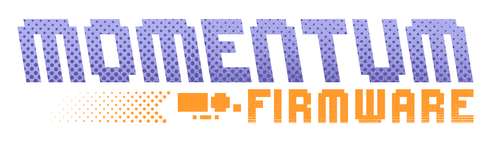
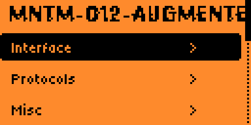
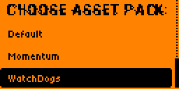
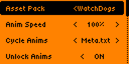
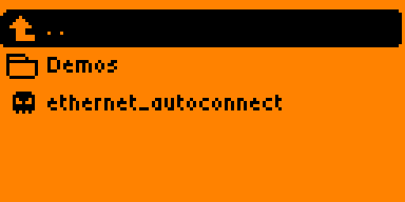

[](https://www.a2as.org/certified/agents/joseguzman1337/momentum-firmware?utm_source=github&utm_medium=pull_request) 

<p align="center">
  <picture>
    <source media="(prefers-color-scheme: dark)" srcset=".github/assets/logo_dark.png">
    <source media="(prefers-color-scheme: light)" srcset=".github/assets/logo_light.png">
    
  </picture>
</p>

<h2 align="center">
  <a href="#Install">Install</a> · <a href="#list-of-changes">Features</a> · <a href="https://discord.gg/momentum">Discord</a> · <a href="#%EF%B8%8F-support">Donate</a>
</h2>

This custom firmware is based on the [Official Firmware](https://github.com/flipperdevices/flipperzero-firmware) for [Flipper Zero](https://flipperzero.one/), and includes most of the awesome features from [Unleashed](https://github.com/DarkFlippers/unleashed-firmware). It is a direct continuation of the Xtreme firmware, built by the same (and only) developers who made that project special.

<br>

## ✨ What Makes Momentum Special

NX Augmented is a **FAP/FAL-first Flipper Zero platform**. User-facing capabilities are delivered as external FAP applications, app-specific extensions as FAL plugins, and only the stable platform, hardware drivers, loader, storage, and ABI services remain in the firmware image. Host-side automation builds, tests, installs, and monitors those artifacts; it is not a permanently running service on the Flipper.

### 🤖 Industry-First AI Automation
- **Specialized AI agent workflows** for development, security, and operations when their configured host runners are invoked
- **MCP (Model Context Protocol)** integration for host-side agent capabilities when configured
- **Strawberry Toolkit** for AI hallucination detection in code review
- **Smart Flash** - AI-enhanced build workflows with ESP orchestration
- **Automated App Management** - A host command that imports available official-catalog sources; `fap_deploy` separately validates catalog artifacts, hashes, target API compatibility, and the complete staged set before transfer
- **Auto USB Ethernet** - Zero-config internet sharing ([FLIPPER_AUTO_ETHERNET.md](docs/FLIPPER_AUTO_ETHERNET.md))
  - After host setup, connecting a compatible Flipper can enable USB Ethernet and host Internet sharing
  - One-time setup: `sudo ./scripts/install-flipper-auto-ethernet.sh`

### 🚀 Technical Excellence
- **Native USB Ethernet** with HTTP download helpers ([NativeEthernet.md](docs/reference/NativeEthernet.md))
- **ESP Flasher FAP** - Flash WiFi modules with lwIP HTTP download ([ESP_FLASHER_GUIDE.md](docs/ESP_FLASHER_GUIDE.md))
  - Auto-download ESP32 Marauder firmware over USB Ethernet
  - Support for all ESP32 variants (ESP32, S2, S3, C3)
  - One-click flash for WiFi Devboard v1
- **Forked Submodule Workflow** for pinned, reproducible dependency inputs, with compilation still enforced by the build gates
- **Asset Pack System** - Complete theming with Anims/Icons/Fonts
- **Extended JavaScript API** - Mass storage, file operations, and more
- **Advanced Security** - Lock on boot, PIN protection, secure storage

### 📦 FAP/FAL Delivery Matrix

The split below is the delivery contract for NX Augmented. FAP/FAL artifacts remain versioned against the exported firmware API; a compatible firmware build and SD card are therefore still required.

| Capability group | Delivered as | Firmware responsibility |
|---|---|---|
| Momentum Settings (`momentum_app.fap`), Bad Keyboard (`bad_kb.fap`), BLE Spam (`ble_spam.fap`), FindMy (`findmy.fap`), NFC Maker (`nfc_maker.fap`), Wardriver (`wardriver.fap`) and ESP Flasher (`esp_flasher.fap`) | **FAP applications**, installed below `/ext/apps/` by category | Stable GUI, loader, storage, USB/BLE/NFC/Sub-GHz/GPIO services and exported ABI |
| NFC parsers/protocol extensions, Sub-GHz GPS (`/ext/apps_data/subghz_gps/plugins/subghz_gps.fal`), JavaScript modules (`/ext/apps_data/js_app/plugins/*.fal`) and app-specific protocol handlers | **FAL plugins** loaded by their owning FAP/platform app | Plugin loader, API resolver, protocol HALs and ABI validation |
| File search/management, disk-image mounting/Mass Storage and the extended JavaScript file/UsbDisk APIs | **FAP features and FAL JavaScript modules** | Sandboxed storage, USB device mode, file browser integration and exported ABI |
| Desktop keybinds, menu organization, asset-pack selection, spoofing controls, RGB profiles and Video Game Module color settings | **FAP configuration surfaces plus SD-card data** | Settings service, desktop hooks and hardware-facing services |
| Lock on boot, PIN handling, false-PIN reset policy and secure application storage | **FAP configuration over minimal security services** | Boot/lock enforcement, cryptographic primitives and protected storage boundaries |
| Asset packs (`/ext/asset_packs/`), shared application resources (`/ext/<feature>/assets/`), embedded read-only FAP assets, menu/keybind configuration, spoofing profiles, RGB profiles and persistent state (`/ext/apps_data/`) | **SD-card resources/configuration** consumed by FAPs/FALs; shared paths remain available to CLI and companion apps | Storage primitives, settings migration and resource loading |
| Native USB Ethernet, HTTP transport, security/lock primitives, hardware drivers, radio services and application ABI | **Minimal firmware platform services** | Built into CPU1 firmware because applications require privileged hardware or system integration |
| Smart Flash, catalog resolution, agent routing, Strawberry checks, MCP integrations, submodule synchronization and notifications | **Host automation** | No resident agent runtime; tools operate only when installed, configured, and invoked on a host |

This architecture preserves the capabilities listed below while keeping independently updateable features outside the constrained CPU1 firmware image.

### 🎨 Extensive Customization
- **Momentum Settings App** - Configure everything from one place
- **Desktop Keybinds** - Full key remapping and press/hold actions
- **Main Menu Customization** - Add directories, JS files, reorganize freely
- **Bad-Keyboard** - Full BLE/USB spoofing with custom VID/PID
- **RGB Backlight** - Rainbow mode and per-app color profiles

<br>
<h2 align="center">Modus Operandi</h2>

The goal of this firmware is to constantly push the bounds of what is possible with Flipper Zero, driving the innovation of many new groundbreaking features, while maintaining the easiest and most customizable user experience of any firmware. Fixing bugs promptly and ensuring a stable and compatible system is also of our utmost importance.

- <h4>Feature-rich: Useful third-party and NX capabilities are packaged as compatible FAP/FAL artifacts where possible. Inclusion is based on repository manifests, ABI compatibility, build results, and device testing—not an unconditional claim to contain every external app.</h4>

- <h4>Stable: We ensure the most stable experience possible by having an actual understanding of what's going on, and proactively making all tweaks and additions backwards-, and inter-, compatible.</h4>

- <h4>Customizable: You can tweak just about everything you see: add/remove apps from the menu, change the animations, replace icon graphics, change your Flipper's name, change how the main menu looks, setup different keybinds like never before, and so much more. All on-device, with no complicated configuration.</h4>

- <h4>AI-assisted: Host-side agent workflows support development, security review, build automation, and quality assurance. Their output is reviewed through the same build and device-validation gates as any other contribution.</h4>

<br>

<h2 align="center">Contributing</h2>

We politely welcome contributions in any programming language, as long as they help the project and are well documented. For guidance on style, tooling, and build requirements, see <a href="docs/CONTRIBUTING.md">CONTRIBUTING.md</a>.

The sections below highlight staple additions. The repository's [List of changes](#list-of-changes), manifests, and release notes are the authoritative inventory for this fork.

<br>
<details>
<summary><strong>Momentum Settings</strong></summary>

<h2 align="center">Momentum Settings</h2>

We offer a powerful and easy-to-use application tailor-made for our firmware, that lets you configure everything you could dream of, and more:




- <ins><b>Interface:</b></ins> Tweak every part of your Flipper, from the desktop animations, to the main menu, lockscreen behavior, file browser, etc.

- <ins><b>Protocols:</b></ins> Configure SubGhz settings, add/remove custom frequencies, extend SubGhz frequencies to 281-361, 378-481, 749-962 MHz and setup which GPIO pins are used by different external modules.

- <ins><b>Misc:</b></ins> Everything else that doesn't fit the previous categories. Change your Flipper's name, XP level, screen options, and configure the <a href="https://github.com/Z3BRO/Flipper-Zero-RGB-Backlight">RGB backlight</a>.

<br>

</details>

<br>

<details>
<summary><strong>Animations / Asset Packs</strong></summary>

<h2 align="center">Animations / Asset Packs</h2>

We created our own improved Animation / Asset system that lets you create and cycle through your own `Asset Packs` with only a few button presses, allowing you to easily load custom Animations, Icons and Fonts like never before. Think of it as a Theme system that's never been easier.


You can easily create your own pack, or find some community-made ones on <b><a href="https://momentum-fw.dev/asset-packs">the Momentum website</a> or on Discord</b>. See <a href="docs/reference/file_formats/AssetPacks.md">the local Asset Pack guide</a> for a tutorial. Each <code>Asset Pack</code> can configure its own <code>Anims</code>, <code>Icons</code> & <code>Fonts</code>.

<br clear="left"/>

<br>


Once you have some asset packs, upload them to your Flipper in <code>SD/asset_packs</code> (if you did this right you should see <code>SD/asset_packs/PackName/Anims</code> and/or <code>SD/asset_packs/PackName/Icons</code>). Alternatively, install directly using the website.


<br clear="left"/>

<br>


After installing the packs to Flipper, hit the <code>Arrow Up</code> button on the main menu and go to <code>Momentum Settings > Interface > Graphics</code>. Here choose which asset pack you want and tweak the other settings how you prefer, then exit the app to reboot and enjoy your fully customized Flipper!

<br clear="left"/>

<br>

</details>

<br>

<details>
<summary><strong>Bad Keyboard</strong></summary>

<h2 align="center">Bad Keyboard</h2>


BadUSB is a great app, but it lacks a lot of options. Bad-KB allows you to customize all USB and Bluetooth parameters for your attacks.

In Bluetooth mode it allows you to spoof the display name and MAC address of the device to whatever you want. Showing up as a portable speaker or a wireless keyboard is easily doable, allowing you to get the attention of your target without needing a cable at hand.

In USB mode it also enables additional functionality to spoof the manufacturer and product names, as well as vendor and product IDs (VID/PID).

<br>

</details>

<h2 align="center">List of changes</h2>

There are too many to name them all; this is a **non-comprehensive** list of the **most notable from an end-user perspective**. For exact changes, read this fork's [releases](https://github.com/joseguzman1337/Momentum-Firmware/releases), manifests, commits, and source. A broader firmware comparison is available on the [Momentum website](https://momentum-fw.dev/).

This repository regularly integrates compatible work from [Unleashed](https://github.com/DarkFlippers/unleashed-firmware) and [OFW](https://github.com/flipperdevices/flipperzero-firmware). The list below focuses on NX/Momentum changes; the pinned revisions and merge history establish exactly which upstream changes are present. A huge thank you to both teams!

<details>
<summary><b>📋 View detailed changes (Added, Updated, Externalized)</b></summary>

```txt
[Added]

### Device Capabilities (FAP/FAL-first, backed by platform services)
- Momentum App (Easy configuration of features and behavior of the firmware)
- Asset Packs (Unparalleled theming and customization)
- Native USB Ethernet support (CDC-ECM) - [Read Docs](docs/reference/NativeEthernet.md)
- USB Ethernet HTTP download helper (HTTP GET to Storage via lwIP)
- More UI customization, redesigns and optimizations
- Bad-Keyboard App
- BLE Spam App
- FindMy Flipper App
- NFC Maker App
- Wardriver App
- File Search across SD Card
- Additional NFC parsers and protocols
- NFC Type 4 protocol and NTAG4xx support
- Subdriving (saving GPS coordinates for Sub-GHz)
- Easy spoofing (Name, MAC address, Serial number)
- Video Game Module color configuration right from Flipper
- Enhanced RGB Backlight modes (Full customization & Rainbow mode)
- File management on device (Cut, Copy, Paste, Show, New Dir, etc.)
- Remember Infrared GPIO settings and add IR Blaster support in apps
- Advanced Security measures (Lock on Boot, reset on false pins, etc.)
- Disk Image management (Mount and view image contents, open in Mass Storage)
- Extended JavaScript API (Support for UsbDisk/Mass Storage, File operations)

### Host AI & Developer Tooling Infrastructure
- **Multi-Agent AI workflows** for on-demand or scheduled development tasks (the documented roster describes roles, not continuously resident workers)
- **Smart Flash Target** - AI-enhanced build and flash workflow with ESP MCP orchestration
- **Warp CLI** (`scripts/flipper_warp_cli.py`) - Direct CLI control for AI agents
- **App Catalog Manager** (`scripts/warp_app_manager.py`) - Automated app downloads
- **Strawberry Toolkit** - AI hallucination detection for code review
- **MCP Server Integration** - GitHub, Context7, ESP Flasher, Playwright
- **FlipperSerial Submodule** (`tools/fz`) - Python library for device communication
- **ESP MCP Orchestrator** - Rust-based build automation with real-time monitoring
- **Forked Submodule Workflow** - Automated dependency sync - [Read Docs](docs/reference/ForkedDevelopment.md)
- **Agent Task Router** - Intelligent distribution of development tasks
- **WARP.md Documentation** - Comprehensive AI agent integration guide
```
```txt
[Updated]

- Enhanced WiFi support for easiest setup ever
- Extended keyboard with cursor movement and symbols
- File Browser with Sorting, More supported File Types
- Advanced and optimized Level System (Up to 30 levels)
- Desktop Keybind system for full key and press/hold remapping
- Storage backend with instant rename and virtual mounting for disk images
- Expanded Sub-GHz App (Duplicate detection & Ignore, Autosave, History improvements)
- Improved Error Messages (Showing source file paths)
```
```txt
[Externalized from the CPU1 image]

- Optional applications ship as SD-card FAPs instead of consuming firmware flash
- Extensible commands, parsers, protocols, and JavaScript modules ship as FAL plugins
- Shared resources and mutable user data remain on SD so CLI and companion applications retain access
```

</details>


<br>

<h2 align="center">Install</h2>

Four update workflows are described below. For NX Augmented, the release artifacts from this fork are authoritative; the recommended route is its **qFlipper package (.tgz)**. Hosted Momentum services must only be used when they explicitly identify the same NX Augmented release and commit.

> <details><summary><code>Web Updater (Chrome)</code></summary><ul>
>   <li>Make sure qFlipper is closed</li>
>   <li>Open the <a href="https://momentum-fw.dev/update">Web Updater</a></li>
>   <li>Continue only if the updater explicitly lists the NX Augmented release and commit from this fork; otherwise use the qFlipper package below</li>
>   <li>Click <code>Connect</code> and select your Flipper from the list</li>
>   <li>Select which update <code>Channel</code> you prefer from the dropdown</li>
>   <li>Click <code>Install</code> and wait for the update to complete</li>
> </ul></details>

> <details><summary><code>Flipper Lab/App (chrome/mobile)</code></summary><ul>
>   <li>(Desktop) Make sure qFlipper is closed</li>
>   <li>(Mobile) Make sure you have the <a href="https://docs.flipper.net/mobile-app">Flipper Mobile App</a> installed and paired</li>
>   <li>Open this fork's <a href="https://github.com/joseguzman1337/Momentum-Firmware/releases/latest">latest release page</a></li>
>   <li>Click the <code>☁️ Flipper Lab/App (chrome/mobile)</code> link</li>
>   <li>(Desktop) Click <code>Connect</code> and select your Flipper from the list</li>
>   <li>(Desktop) Click <code>Install</code> and wait for the update to complete</li>
>   <li>(Mobile) Accept the prompt to open the link in the Flipper Mobile App</li>
>   <li>(Mobile) Confirm to proceed with the install and wait for the update to complete</li>
> </ul></details>

> <details><summary><code>qFlipper Package (.tgz)</code></summary><ul>
>   <li>Download the qFlipper package (.tgz) from this fork's <a href="https://github.com/joseguzman1337/Momentum-Firmware/releases/latest">latest release page</a></li>
>   <li>Make sure the <code>WebUpdater</code> and <code>lab.flipper.net</code> are closed</li>
>   <li>Open <a href="https://flipperzero.one/update">qFlipper</a> and connect your Flipper</li>
>   <li>Click <code>Install from file</code></li>
>   <li>Select the .tgz you downloaded and wait for the update to complete</li>
> </ul></details>

> <details><summary><code>Zipped Archive (.zip)</code></summary><ul>
>   <li>Download the zipped archive (.zip) from this fork's <a href="https://github.com/joseguzman1337/Momentum-Firmware/releases/latest">latest release page</a></li>
>   <li>Extract the archive. This is now your new Firmware folder</li>
>   <li>Open <a href="https://flipperzero.one/update">qFlipper</a>, head to <code>SD/update</code> and simply move the firmware folder there</li>
>   <li>On the Flipper, hit the <code>Arrow Down</code> button, this will get you to the file menu. In there simply search for your updates folder</li>
>   <li>Inside that folder, select the Firmware you just moved onto it, and run the file thats simply called <code>Update</code></li>
> </ul></details>

<br>

<details>
<summary><strong>Build it yourself</strong></summary>

<h2 align="center">Build it yourself</h2>

### Quick Start

```bash
# Clone the repository with all submodules
$ git clone --recursive --jobs 8 https://github.com/joseguzman1337/Momentum-Firmware.git
$ cd Momentum-Firmware/
```

### Build & Flash Options

#### 🚀 Smart Flash (Recommended - AI-Enhanced Workflow)
```bash
$ ./fbt smart_flash
```
**What it does when the corresponding host dependencies and devices are available:**
- Builds complete updater package with all resources
- Auto-installs Python dependencies (`colorlog`, `pyserial`)
- Launches ESP MCP orchestrator (if Rust `cargo` is available)
- Provides beautiful, color-coded progress output
- Auto-detects Flipper USB port and ESP devboard port
- Coordinates firmware and supported WiFi-devboard update steps and reports failures for recovery

**Requirements:**
- Flipper connected via USB
- qFlipper closed
- Optional: Rust/Cargo for ESP MCP orchestrator features

#### ⚡ Classic USB Flash
```bash
# Full flash (firmware + radio stack + resources)
$ ./fbt flash_usb_full

# Firmware only (faster, for code-only changes)
$ ./fbt flash_usb
```

#### 🔧 Debug Probe Flash (SWD)
```bash
$ ./fbt flash
```
Auto-detects supported debug probes (ST-Link, Blackmagic, WiFi devboard, etc.)

#### 📦 Build Release Packages
```bash
# Full updater package (for Web Updater / qFlipper)
$ ./fbt updater_package

# Minimal package (firmware DFU only)
$ ./fbt updater_minpackage

# Build firmware distribution
$ ./fbt fw_dist

# Build external app plugins
$ ./fbt fap_dist
```

### Development Workflows

#### Single App Development
```bash
# Build and launch a specific app
$ ./fbt launch APPSRC=your_appid

# Build with unit tests
$ ./fbt FIRMWARE_APP_SET=unit_tests updater_package
```

#### App Catalog Management
```bash
# Auto-download missing apps from Flipper Catalog
$ python3 scripts/warp_app_manager.py
```

#### Agent-Driven CLI Control
```bash
# Direct device CLI access for AI agents
$ ./scripts/flipper_warp_cli.py <command>

# Examples:
$ ./scripts/flipper_warp_cli.py uptime
$ ./scripts/flipper_warp_cli.py storage info
$ ./scripts/flipper_warp_cli.py led r 255
```

### AI Agent Workflows

For comprehensive AI agent integration, MCP server usage, and advanced automation workflows:

📖 **See [WARP.md](WARP.md)** for detailed documentation on:
- Warp CLI agent control patterns
- MCP server integration
- Build automation for CI/CD
- Unit test execution workflows
- Linting and formatting automation

</details>


<h2 align="center">AI Automation Ecosystem</h2>

This repository includes host-side **multi-agent workflow definitions** for development, security review, operations, and architectural governance. They can automate configured portions of firmware development, testing, and deployment when explicitly invoked; availability depends on the installed runners, credentials, services, and connected hardware.

<details>
<summary><b>🤖 View Agent Roster & Automation Infrastructure</b></summary>

### Agent Roster
The following roster documents routing roles supported by the host orchestration layer. A listed role does not claim that a provider is installed, authenticated, or continuously running:

| Agent | Role | Focus Area | Primary Tools |
|-------|------|------------|---------------|
| **Gemini** | **Architect** | Strategic planning, System Design, Orchestration | MCP Servers, Architecture Review |
| **Codex** | **Engineer** | Feature implementation, Bug fixes, Refactoring | GitHub Copilot, Code Generation |
| **Claude** | **Security** | CVE patching, Vulnerability scanning, Hardening | Strawberry Toolkit, Security Analysis |
| **Jules** | **Ops** | Async Cloud tasks, Submodule synchronization | Cloud APIs, Async Workflows |
| **DeepSeek** | **Performance** | Optimization, Latency reduction | Profiling, Benchmarking |
| **Warp** | **QA** | Code quality analysis, Test generation, CI/CD | Warp CLI, FBT Automation |
| **Amazon Q** | **Infra** | Cloud infrastructure, AWS/GCP integrations | AWS Services, Firebase |
| **Kiro** | **Build** | FBT (Flipper Build Tool) workflow automation | Smart Flash, Build Optimization |

### Core Automation Scripts

#### Build & Flash Automation
- **`scripts/flipper_warp_cli.py`**: Direct CLI interface for agents to communicate with connected Flipper devices
  - Stateless command execution (no interactive shell overhead)
  - Auto-discovery of serial ports (`/dev/ttyACM0`)
  - Integrated FlipperSerial library from `tools/fz` submodule
  - Mock dependency handling for restricted environments
  - Usage: `./scripts/flipper_warp_cli.py <command>`

- **ESP MCP Orchestrator** (`.ai/esp_mcp_orchestrator/`): Rust-based orchestration tool for smart flash workflows
  - Real-time progress monitoring with colored output
  - Automatic ESP port detection
  - Integration with `smart_flash` FBT target
  - Handles dependency installation (`colorlog`, `pyserial`)

#### App Management
- **`scripts/warp_app_manager.py`**: Flipper app catalog source importer and deployment launcher
  - Fetches latest apps from official Flipper Catalog API
  - Scans existing `applications/external` and `applications_user` directories
  - Identifies missing catalog aliases, rejects unsafe paths, and resolves available upstream repositories
  - Extracts repository URLs from catalog metadata
  - Usage: `python3 scripts/warp_app_manager.py`

#### Agent Orchestration
- **`.ai/scripts/orchestrator.py`**: Host task orchestrator
  - Multi-agent task distribution and load balancing
  - Run with `--yolo-mode` for full autonomous operation
  - Coordinates between Gemini, Claude, Codex, and other agents

- **`.ai/scripts/sync_submodules.py`**: Forked dependency management
  - Automates synchronization of all forked submodules
  - Verifies compile-time integrity before merging
  - See [Forked Development Documentation](docs/reference/ForkedDevelopment.md)

- **`.ai/scripts/task_router.py`**: Intelligent task routing
  - Analyzes task requirements and routes to optimal agent
  - Context-aware agent selection based on specialization

- **`.ai/scripts/notify.py`**: System-wide notification bus
  - Cross-agent communication channel
  - Slack/Discord integration for build status alerts

### Security & Quality Assurance

#### Strawberry Hallucination Detection
The **Strawberry Toolkit** (`.ai/strawberry/`) supplies additional static checks for common AI-generated-code mistakes:
- Static analysis of AI code contributions
- Pattern recognition for common AI mistakes
- Integration with Claude Security Agent for CVE scanning
- Automated PR review with hallucination flagging

### MCP (Model Context Protocol) Integration

When configured and reachable, **MCP servers** can give host agents access to:
- **ESP Flasher MCP** (`.ai/mcp/servers/esp_mcp/`): Direct control of ESP32 flashing operations
- **GitHub MCP**: PR creation, issue management, code review automation
- **Context7 MCP**: Library-documentation retrieval to support code generation
- **Playwright MCP**: Automated web testing and UI validation

See **WARP.md** for detailed MCP usage and integration patterns.

### Developer Tools & Submodules

- **`tools/fz`** (submodule from [x31337/fz](https://github.com/x31337/fz)): FlipperSerial library
  - Python library for Flipper Zero serial communication
  - Used by Warp CLI for agent-driven device control
  - Mock-friendly architecture for testing environments

- **`.ai/mcp/servers/esp_mcp`**: ESP32 operations via MCP protocol
  - Flash firmware to WiFi devboard
  - Monitor serial output
  - Automated port detection

</details>


### Submodule Synchronization
We use a forked submodule workflow to verify integrity and compile-time stability.
To sync all submodules to your personal fork:
```bash
python3 .ai/scripts/sync_submodules.py
```
For more details, see [Forked Development Documentation](docs/reference/ForkedDevelopment.md).


<h2 align="center">Stargazers over time</h2>

[](https://starchart.cc/joseguzman1337/Momentum-Firmware)

<h2 align="center">❤️ Support</h2>

If you enjoy the firmware please __**spread the word!**__ And if you really love it, maybe consider donating to the team? :D

> **[Ko-fi](https://ko-fi.com/willyjl)**: One-off or Recurring, No signup required

> **[PayPal](https://paypal.me/willyjl1)**: One-off, Signup required

> **BTC**: `1EnCi1HF8Jw6m2dWSUwHLbCRbVBCQSyDKm`

**Thank you <3**
